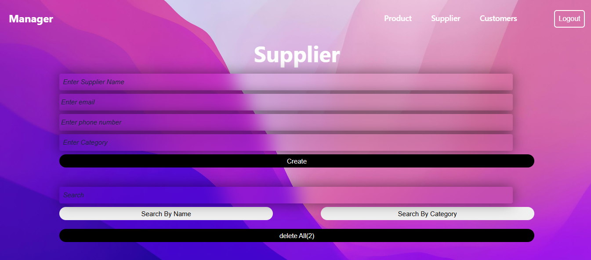
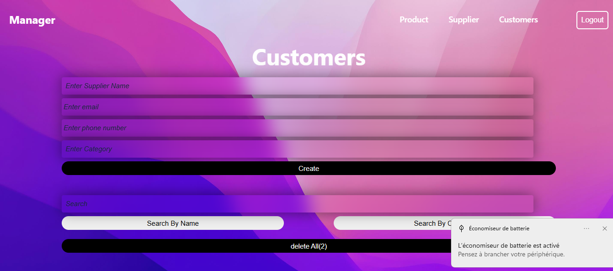

<div align="center">

  <div>
    
    
    
    
    
  </div>

  <h3 align="center">🛠️ Inventory & Customer Management Web App</h3>

  <div align="center">
    A modular browser-based management system built with HTML, CSS, and JavaScript.  
    Manage products, suppliers, and customers efficiently — with no backend required.
  </div>
</div>

---

## 📋 <a name="table">Table of Contents</a>

1. 🤖 [Introduction](#introduction)
2. ⚙️ [Tech Stack](#tech-stack)
3. 🔋 [Features](#features)
4. 📸 [Screenshots](#screenshots)
5. 🚀 [Quick Start](#quick-start)

---

## <a name="introduction">🤖 Introduction</a>

This web application is a complete browser-based management system featuring three core modules:

- **📦 Product Management**: Track inventory, pricing, and product categories.
- **📇 Supplier Management**: Maintain and update supplier records.
- **👥 Customer Management**: Organize client data and records.

All data is stored in the browser using **localStorage**, enabling offline use with data persistence between sessions.

---

## <a name="tech-stack">⚙️ Tech Stack</a>

- **HTML5**
- **CSS3**
- **Vanilla JavaScript**
- **Chart.js** (for visual statistics)
- **JSON** (for structured data handling)
- **localStorage** (for client-side persistence)

---

## <a name="features">🔋 Features</a>

### 📦 Product Management

- Add products with title, price, taxes, ads cost, discount, and category
- Real-time total price calculation
- Add multiple products at once
- Edit or delete individual products
- Bulk delete all products
- Visual chart displaying product stats

### 📇 Supplier Management

- Add supplier entries (name, company, contact info, etc.)
- Edit or delete suppliers
- Search and filter by name or company
- Persistent data via localStorage

### 👥 Customer Management

- Add and manage client records (name, ID, address, etc.)
- Search customer data
- Update or delete client entries
- Simple and fast localStorage handling

---

## <a name="screenshots">📸 Screenshots</a>

### 📦 Product Management Screenshots

#### 🏠 Product Dashboard
<p align="center">
  
</p>

#### ➕ Add Products
<p align="center">
  
</p>

#### 📊 Product Statistics Chart
<p align="center">
  
</p>

---

### 📇 Supplier Management Screenshots

#### 📋 Supplier Dashboard
<p align="center">
  
</p>

#### ➕ Add Supplier
<p align="center">
  
</p>

---

### 👥 Customer Management Screenshots

#### 🧾 Customer Dashboard
<p align="center">
  
</p>

#### 🔍➕ Add Customers
<p align="center">
  
</p>

---

## <a name="quick-start">🤸 Quick Start</a>

1. Clone the repository:
   ```bash
   git clone https://github.com/your-username/product-management-system.git
   cd product-management-system
