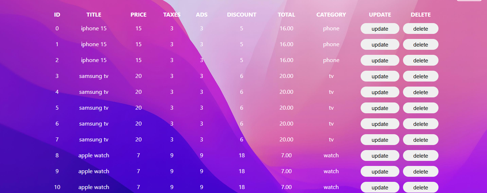
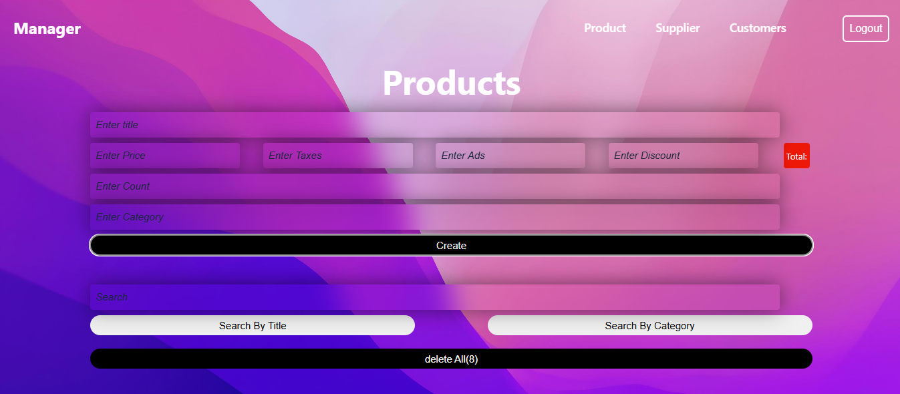
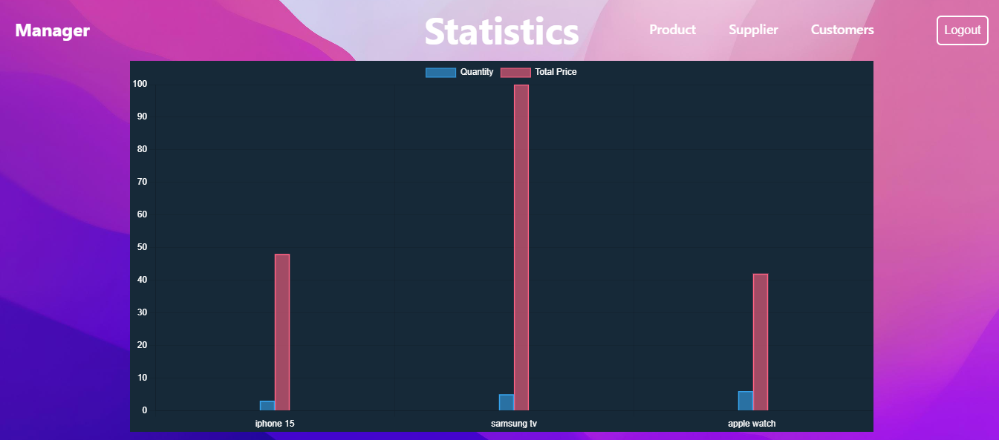

<div align="center">

  <div>
    
    
    
    
    
  </div>

  <h3 align="center">🛒 Product Management System</h3>

  <div align="center">
    A simple yet powerful product management tool built with HTML, CSS, and JavaScript. Easily manage products, visualize statistics, and store data locally — all in your browser.
  </div>
</div>

---

## 📋 Table of Contents

1. 🤖 [Introduction](#introduction)
2. ⚙️ [Tech Stack](#tech-stack)
3. 🔋 [Features](#features)
4. 📸 [Screenshots](#screenshots)
5. 🚀 [Getting Started](#getting-started)
6. 🔗 [Links](#links)

---

## 🤖 Introduction

This project is a lightweight **Product Management System** designed to perform full CRUD operations and local data persistence. It allows users to create, edit, delete, and search products with advanced functionality like real-time price calculation, batch entry, chart visualization, and more.

All data is saved in the **browser's localStorage**, so you won't lose your product data even after refreshing or closing the browser tab.

---

## ⚙️ Tech Stack

- **HTML5**
- **CSS3**
- **Vanilla JavaScript**
- **JSON**
- **Chart.js** (for statistics)

---

## 🔋 Features

### 🧾 Product Management

- Create new products with:
  - Title
  - Price
  - Taxes
  - Ads cost
  - Discount
  - Category
- Automatic total price calculation
- Add multiple products at once
- Update or delete individual products
- Delete all products with one click

### 🔎 Search

- Search by **title** or **category**
- Instant filtering as you type

### 📊 Statistics

- View a dynamic **bar chart** showing:
  - Total product quantities
  - Total values per product title

### 💾 Local Storage

- All product data is saved in **localStorage**
- No need for a backend — your data persists between sessions

---

## 📸 Screenshots

> *(Add your actual screenshots in the `screenshots/` folder and replace the filenames)*

#### 🏠 Main Interface
<p align="center">
  
</p>

#### ➕ Add Products
<p align="center">
  
</p>

#### 📊 Statistics Chart
<p align="center">
  
</p>


---

## 🚀 Getting Started

1. Clone the repository:
   ```bash
   git clone https://github.com/your-username/product-management-system.git
   cd product-management-system
